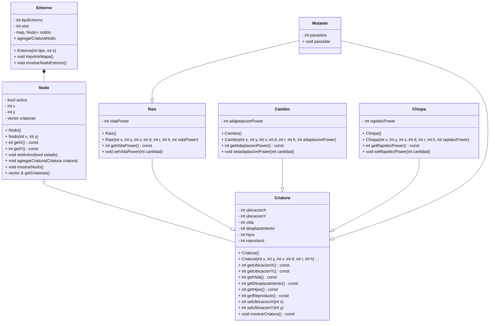

```mermaid
classDiagram

class Entorno {
- int tipoEntorno
- int size
- map<pair<int, int>, Nodo> nodos
+ Entorno(int tipo, int s)
+ void imprimirMapa()
+ void mostrarNodoEntorno()
+ agregarCriaturaNodo
}

class Nodo {
- bool activo
- int x
- int y
- vector <Criatura*> criaturas
+ Nodo()
+ Nodo(int x, int y)
+ int getX() const
+ int getY() const
+ void setActivo(bool estado)
+ void agregarCriatura(Criatura criatura)
+ void mostrarNodo()
+ vector <Criatura*>&  getCriaturas()

}

class Criatura {
- int ubicacionX
- int ubicacionY
- int vida
- int desplazamiento
- int hijos
- int reproducir
+ Criatura()
+ Criatura(int x, int y, int v, int d, int r, int h);
+ int getUbicacionX() const
+ int getUbicacionY() const
+  int getVida() const
+  int getDesplazamiento() const
+  int getHijos() const
+  int getReproducir() const
+  int setUbicacionX(int x)
+  int setUbicacionY(int y)
+  void mostrarCriatura() const
}

class Raiz {
- int vidaPower
+  Raiz()
+ Raiz(int x, int y, int v, int d, int r, int h, int vidaPower)
+ int getVidaPower() const
+ void setVidaPower(int cantidad)

}

class Cambio {
- int adapatacionPower
+ Cambio()
+ Cambio(int x, int y, int v, int d, int r, int h, int adaptacionPower)
+ int getAdaptacionPower() const
+ void setadaptacionPower(int cantidad)
}

class Chispa {
- int rapidezPower
+ Chispa()
+ Chispa(int x, int y, int v, int d, int r, int h, int rapidezPower)
+ int getRapidezPower() const
+ void setRapidezPower(int cantidad)
}
class Mutante {
- int parasitos
+ void parasitar
}

Entorno *-- Nodo 
Nodo o-- Criatura 
Raiz --|> Criatura
Cambio --|> Criatura
Chispa --|> Criatura
Mutante --|> Raiz 
Mutante --|> Criatura


```
