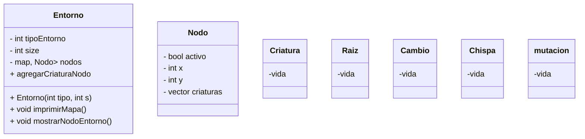

```mermaid
classDiagram

class Entorno {
- int tipoEntorno
- int size
- map<pair<int, int>, Nodo> nodos
+ Entorno(int tipo, int s)
+ void imprimirMapa()
+ void mostrarNodoEntorno()
+ agregarCriaturaNodo
}

class Nodo {
- bool activo
- int x
- int y
- vector <Criatura> criaturas
}

class Criatura {
-vida
}

class Raiz {
-vida
}

class Cambio {
-vida
}

class Chispa {
-vida
}

class mutacion {
-vida
}

```
